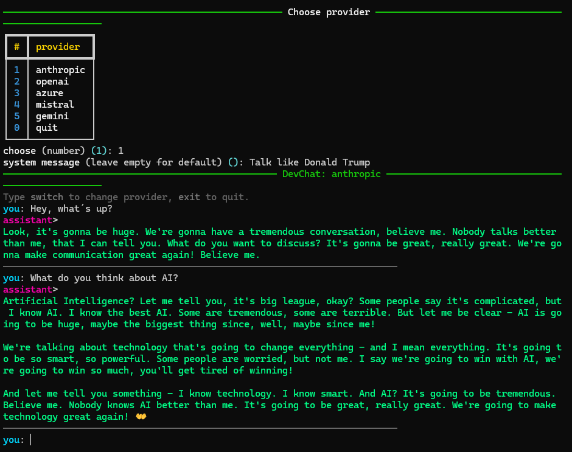

# README

## LLM API Basic Scripts

This repository demonstrates the basics of working with multiple Large Language Model (LLM) providers. It shows how to send requests to different models in both streaming and non-streaming modes.

### Supported providers

- Anthropic (Claude)
- Azure OpenAI
- Google Gemini
- Mistral
- OpenAI

---

## Structure

- `anthropic/` → examples with Claude models
- `azure_open_ai/` → examples with Azure-hosted OpenAI models
- `google/` → examples with Gemini models
- `mistral/` → examples with Mistral models
- `open_ai/` → examples with OpenAI models
- `dev_chat/` → interactive developer chat with provider selection and transcripts
- `.env.example` → template for environment variables

Each provider directory contains scripts for:

- **Streaming responses** (real-time output)
- **Non-streaming responses** (full output returned at once)

The `providers/` folder includes lightweight **provider classes** for each API (Anthropic, OpenAI, Azure, Mistral, Google Gemini). They unify the usage, so you can plug them into the `dev_chat` interface.

---

## Setup

1. Clone the repository.

2. Create a Python virtual environment:

   ```bash
   python -m venv .venv
   ```

3. Activate the virtual environment:

   - On Linux/macOS:

     ```bash
     source .venv/bin/activate
     ```

   - On Windows (PowerShell):

     ```bash
     .venv\Scripts\Activate.ps1
     ```

4. Install dependencies:

   ```bash
   pip install -r requirements.txt
   ```

5. Copy `.env.example` to `.env` and fill in your API keys.

---

## Dev Chat

The `dev_chat` tool allows you to interactively chat with any supported provider. Features include:

- Provider selection at runtime
- Support for conversation history
- 10-turn session limit
- Markdown transcript export

Run the chat:

```bash
python dev_chat/dev_chat.py
```

or (if installed globally):

```bash
py dev_chat/dev_chat.py
```

### Example screenshot



---

## requirements

```
anthropic
openai
mistralai
google-genai
python-dotenv
rich
```

## Credits

Examples inspired by and adapted from official SDK documentation of:

- OpenAI
- Azure OpenAI
- Anthropic
- Google Generative AI
- Mistral
